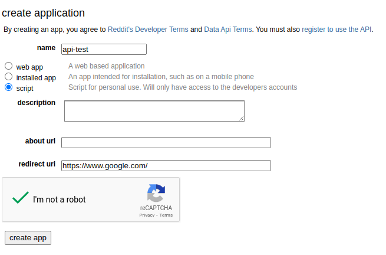
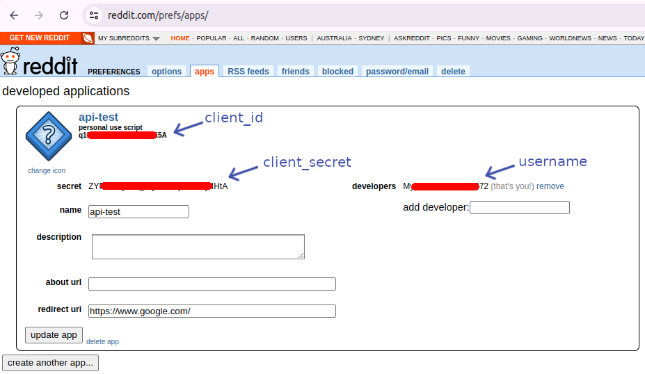

# Fetch-Reddit-data
Simple script using `praw` package to fetch reddit data

# Setup Redit API
We need to connect to reddit using the api information from our reddit account. If you do not have it, you need to create it within your account. To do so:

- Login to your reddit account in a browswer.
  - It is better to use the username and password to create your reddit account, since you need it later on.
    - If you have already created your account using google, apple or any other authenticators, you need to create a password for your account. You may try to delete your account and create a new one. However, during the delete process, it will ask you to assing a password to your account (a hack :smiley:)
- You need to create an App witin your reddit account. To do so:
  - After login, open this following page: https://www.reddit.com/prefs/apps/
  - Click on create another app...
  - Give it a name i.e. api-test
  - **Choose `script`**
  - You may write a description which is optional.
  - "about url" is optional.
  - For redirect url you may use https://www.google.com/



- Then the app would be like this:


To connect to your app using `praw`, in the following code, use:

- `client_id` is written after "personal use script"
- `client_secret` is written in front of the "secret"
- `username` can be your username or the one written in front of the "developers"
- `password` you know your reddit password
- `user_agent` can be anything i.e. "api-test"

```
reddit = praw.Reddit(client_id = '<The client_id or the personal use script>',
                     client_secret = '<The secret variable in your reddit app>',
                     username='<your user name or the developers variable>',
                     password='<your password>',
                     user_agent='<This can be any phrase or the name of your api>')
```
